# 성식당


## 프로젝트명 (서비스명) : 성식당 (sungchef)

### 😋 3가지 추천 알고리즘으로 집밥 메뉴를 추천받아보세요

### 🧑‍🍳 검색어 자동완성과 함께 메뉴를 검색해보세요

### 🔥 영수증 OCR 기반으로 냉장고에 재료를 등록해보세요

### 🍴 단계별로 레시피를 들으며 요리해보세요

## 개발 환경

### Android

IDE
- Android Studio Hedgehog 2023.1.1 Patch2

Version
- kotlin: 1.9.0
- JDK : jbr-17 jetbrains Runtime version 17.0.7

### 📖 Android 라이브러리 및 외부 API 사용
|Name|Version|License|
|------|---|---|
|Glide|compose:1.0.0-beta01|Apache License 2.0|
|Retrofit2|2.9.0|Apache License 2.0|
|okhttp3|4.12.0 |Apache License 2.0|
|Hilt|2.49 |Apache License 2.0|
|Room|2.5.2|Apache License 2.0|
|navigation|navigation-compose:2.7.7|Apache License 2.0|
|paging|paging-compose:3.3.0-alpha04 |Apache License 2.0|
|viewmodel|lifecycle-viewmodel-compose:2.7.0|Apache License 2.0|
|Datastore|datastore-preferences:1.0.0|Apache License 2.0|
|Lottie|lottie-compose:6.4.0|MIT License|
|Kakao Login|v2-user:2.20.1||
|Naver Login|oauth-jdk8:5.9.0||

### Server

IDE
- IntelliJ IDEA 2023.3.2
- IntelliJ Community Edition 2023.3

Version
- Java17
- Gradle 8.6
- SpringBoot 3.2.3

### 📖 BackEnd 라이브러리
- Spring Boot
- Spring Security & JWT
- JPA & Hibernate
- AWS
- Jasypt

### 데이터 분석 & 추천

IDE
- Visual Studio Code 1.85.1

Version
- python 3.8.10
- hadoop 3.2.4
- spark 3.2.4-bin-hadoop3.2
- zeppelin 0.10.1
- zookeeper 3.8.4
- Django 4.2.11


### 전체 디렉토리 구조
<details>
<summary>전체 구조</summary>
  
```bash
📦sungchef
 ┣ 📂apigateway-service
 ┣ 📂discovery-service
 ┣ 📂fridge-service
 ┣ 📂ingredient-service
 ┣ 📂recipe-service
 ┣ 📂recommend-service
 ┣ 📂search-service
 ┗ 📂user-service
```

<details>
<summary>냉장고</summary>
  
```bash
 📂fridge-service
 ┗ 📂main
 ┃ ┣ 📂fridgeservice
 ┃ ┃ ┣ 📂config
 ┃ ┃ ┃ ┣ 📜JasyptConfig.java
 ┃ ┃ ┃ ┣ 📜JwtAuthenticationFilter.java
 ┃ ┃ ┃ ┗ 📜SecurityConfig.java
 ┃ ┃ ┣ 📂controller
 ┃ ┃ ┃ ┣ 📜CheckController.java
 ┃ ┃ ┃ ┗ 📜FridgeController.java
 ┃ ┃ ┃ ┣ 📂db
 ┃ ┃ ┃ ┃ ┣ 📂entity
 ┃ ┃ ┃ ┃ ┃ ┣ 📜Fridge.java
 ┃ ┃ ┃ ┃ ┃ ┗ 📜FridgeLog.java
 ┃ ┃ ┃ ┃ ┗ 📂repository
 ┃ ┃ ┃ ┃ ┃ ┣ 📜BaseRepository.java
 ┃ ┃ ┃ ┃ ┃ ┗ 📜FridgeRepository.java
 ┃ ┃ ┃ ┃ ┣ 📂dto
 ┃ ┃ ┃ ┃ ┃ ┣ 📂request
 ┃ ┃ ┃ ┃ ┃ ┃ ┣ 📂user
 ┃ ┃ ┃ ┃ ┃ ┃ ┃ ┗ 📜SignUpReq.java
 ┃ ┃ ┃ ┃ ┃ ┃ ┗ 📜FridgeIngredientListReq.java
 ┃ ┃ ┃ ┃ ┃ ┗ 📂response
 ┃ ┃ ┃ ┃ ┃ ┃ ┣ 📂user
 ┃ ┃ ┃ ┃ ┃ ┃ ┃ ┗ 📜UserTokenRes.java
 ┃ ┃ ┃ ┃ ┃ ┃ ┣ 📜FridgeIngredientListRes.java
 ┃ ┃ ┃ ┃ ┃ ┃ ┣ 📜Ingredient.java
 ┃ ┃ ┃ ┃ ┃ ┃ ┣ 📜IngredientId.java
 ┃ ┃ ┃ ┃ ┃ ┃ ┗ 📜IngredientInfo.java
 ┃ ┃ ┃ ┃ ┃ ┣ 📂exception
 ┃ ┃ ┃ ┃ ┃ ┃ ┣ 📂error
 ┃ ┃ ┃ ┃ ┃ ┃ ┃ ┣ 📜ErrorCode.java
 ┃ ┃ ┃ ┃ ┃ ┃ ┃ ┗ 📜ErrorResponse.java
 ┃ ┃ ┃ ┃ ┃ ┃ ┣ 📂exception
 ┃ ┃ ┃ ┃ ┃ ┃ ┃ ┣ 📜IngredientNotFoundException.java
 ┃ ┃ ┃ ┃ ┃ ┃ ┃ ┣ 📜JwtException.java
 ┃ ┃ ┃ ┃ ┃ ┃ ┃ ┣ 📜JwtExpiredException.java
 ┃ ┃ ┃ ┃ ┃ ┃ ┃ ┗ 📜RecipeNotFoundException.java
 ┃ ┃ ┃ ┃ ┃ ┃ ┗ 📂handler
 ┃ ┃ ┃ ┃ ┃ ┃ ┃ ┗ 📜GlobalExceptionHandler.java
 ┃ ┃ ┃ ┃ ┃ ┣ 📂service
 ┃ ┃ ┃ ┃ ┃ ┃ ┣ 📂client
 ┃ ┃ ┃ ┃ ┃ ┃ ┃ ┣ 📜IngredientServiceClient.java
 ┃ ┃ ┃ ┃ ┃ ┃ ┃ ┗ 📜UserServiceClient.java
 ┃ ┃ ┃ ┃ ┃ ┃ ┣ 📜ErrorResponseService.java
 ┃ ┃ ┃ ┃ ┃ ┃ ┣ 📜FridgeService.java
 ┃ ┃ ┃ ┃ ┃ ┃ ┣ 📜JwtService.java
 ┃ ┃ ┃ ┃ ┃ ┃ ┗ 📜ResponseService.java
 ┃ ┃ ┃ ┃ ┃ ┣ 📂util
 ┃ ┃ ┃ ┃ ┃ ┃ ┣ 📂result
 ┃ ┃ ┃ ┃ ┃ ┃ ┃ ┣ 📜CommonResult.java
 ┃ ┃ ┃ ┃ ┃ ┃ ┃ ┣ 📜ListResult.java
 ┃ ┃ ┃ ┃ ┃ ┃ ┃ ┗ 📜SingleResult.java
 ┃ ┃ ┃ ┃ ┃ ┃ ┗ 📂sungchefEnum
 ┃ ┃ ┃ ┃ ┃ ┃ ┃ ┣ 📜CommonResponseCode.java
 ┃ ┃ ┃ ┃ ┃ ┃ ┃ ┣ 📜ConvertIngredientType.java
 ┃ ┃ ┃ ┃ ┃ ┃ ┃ ┣ 📜IngredientType.java
 ┃ ┃ ┃ ┃ ┃ ┃ ┃ ┗ 📜UserSnsType.java
```
</details>

<details>
<summary>재료</summary>

```bash
 📂ingredient-service
 ┣ 📂main
 ┃ ┗ 📂ingredientservice
 ┃ ┃ ┣ 📂config
 ┃ ┃ ┃ ┣ 📜JasyptConfig.java
 ┃ ┃ ┃ ┣ 📜JwtAuthenticationFilter.java
 ┃ ┃ ┃ ┗ 📜SecurityConfig.java
 ┃ ┃ ┣ 📂controller
 ┃ ┃ ┃ ┣ 📜CheckController.java
 ┃ ┃ ┃ ┗ 📜IngredientController.java
 ┃ ┃ ┣ 📂db
 ┃ ┃ ┃ ┣ 📂entity
 ┃ ┃ ┃ ┃ ┣ 📜Ingredient.java
 ┃ ┃ ┃ ┃ ┣ 📜IngredientSample.java
 ┃ ┃ ┃ ┃ ┣ 📜IngredientType.java
 ┃ ┃ ┃ ┃ ┣ 📜RecipeIngredient.java
 ┃ ┃ ┃ ┃ ┗ 📜RecipeShowName.java
 ┃ ┃ ┃ ┗ 📂repository
 ┃ ┃ ┃ ┃ ┣ 📜IngredientRepository.java
 ┃ ┃ ┃ ┃ ┣ 📜RecipeIngredientRepository.java
 ┃ ┃ ┣ 📂dto
 ┃ ┃ ┃ ┣ 📂request
 ┃ ┃ ┃ ┃ ┣ 📜ConvertImageReq.java
 ┃ ┃ ┃ ┃ ┗ 📜IngredientListReq.java
 ┃ ┃ ┃ ┗ 📂response
 ┃ ┃ ┃ ┃ ┣ 📜ConvertProduct.java
 ┃ ┃ ┃ ┃ ┣ 📜ConvertProductInfo.java
 ┃ ┃ ┃ ┃ ┣ 📜ConvertProductListRes.java
 ┃ ┃ ┃ ┃ ┣ 📜IngredientId.java
 ┃ ┃ ┃ ┃ ┣ 📜IngredientInfo.java
 ┃ ┃ ┃ ┃ ┣ 📜IngredientListRes.java
 ┃ ┃ ┃ ┃ ┣ 📜IngredientRes.java
 ┃ ┃ ┃ ┃ ┣ 📜RecipeIngredient.java
 ┃ ┃ ┃ ┃ ┣ 📜RecipeIngredientInfo.java
 ┃ ┃ ┃ ┃ ┗ 📜RecipeIngredientListRes.java
 ┃ ┃ ┣ 📂exception
 ┃ ┃ ┃ ┣ 📂error
 ┃ ┃ ┃ ┃ ┣ 📜ErrorCode.java
 ┃ ┃ ┃ ┃ ┗ 📜ErrorResponse.java
 ┃ ┃ ┃ ┣ 📂exception
 ┃ ┃ ┃ ┃ ┣ 📜ConvertOCRException.java
 ┃ ┃ ┃ ┃ ┣ 📜HaveAllIngredientInRecipeException.java
 ┃ ┃ ┃ ┃ ┣ 📜IngredientNotFoundException.java
 ┃ ┃ ┃ ┃ ┣ 📜JwtException.java
 ┃ ┃ ┃ ┃ ┣ 📜JwtExpiredException.java
 ┃ ┃ ┃ ┃ ┗ 📜RecipeNotFoundException.java
 ┃ ┃ ┃ ┗ 📂handler
 ┃ ┃ ┃ ┃ ┗ 📜GlobalExceptionHandler.java
 ┃ ┃ ┣ 📂service
 ┃ ┃ ┃ ┣ 📜ErrorResponseService.java
 ┃ ┃ ┃ ┣ 📜IngredientService.java
 ┃ ┃ ┃ ┣ 📜JwtService.java
 ┃ ┃ ┃ ┣ 📜ResponseService.java
 ┃ ┃ ┣ 📂util
 ┃ ┃ ┃ ┣ 📂result
 ┃ ┃ ┃ ┃ ┣ 📜CommonResult.java
 ┃ ┃ ┃ ┃ ┣ 📜ListResult.java
 ┃ ┃ ┃ ┃ ┗ 📜SingleResult.java
 ┃ ┃ ┃ ┗ 📂sungchefEnum
 ┃ ┃ ┃ ┃ ┣ 📜CommonResponseCode.java
 ┃ ┃ ┃ ┃ ┣ 📜ConvertIngredientType.java
 ┃ ┃ ┃ ┃ ┃ ┗ 📜IngredientType.java
```
</details>

<details>
<summary>레시피</summary>
  
```bash
 📂recipe-service
 ┣ 📂main
 ┃ ┗ 📂recipeservice
 ┃ ┃ ┣ 📂config
 ┃ ┃ ┃ ┣ 📜JasyptConfig.java
 ┃ ┃ ┃ ┣ 📜JwtAuthenticationFilter.java
 ┃ ┃ ┃ ┗ 📜SecurityConfig.java
 ┃ ┣ 📂controller
 ┃ ┃ ┣ 📜CheckController.java
 ┃ ┃ ┗ 📜RecipeController.java
 ┃ ┣ 📂db
 ┃ ┃ ┣ 📂entity
 ┃ ┃ ┃ ┣ 📜Food.java
 ┃ ┃ ┃ ┣ 📜Recipe.java
 ┃ ┃ ┃ ┣ 📜RecipeDetail.java
 ┃ ┃ ┃ ┣ 📜RecipeMake.java
 ┃ ┃ ┃ ┗ 📜RecipeMakeLog.java
 ┃ ┃ ┗ 📂repository
 ┃ ┃ ┃ ┣ 📜FoodRepository.java
 ┃ ┃ ┃ ┣ 📜RecipeDetailRepository.java
 ┃ ┃ ┃ ┣ 📜RecipeMakeRepository.java
 ┃ ┃ ┃ ┗ 📜RecipeRepository.java
 ┃ ┣ 📂dto
 ┃ ┃ ┣ 📂request
 ┃ ┃ ┃ ┣ 📜FoodIdListReq.java
 ┃ ┃ ┃ ┣ 📜MakeRecipeReq.java
 ┃ ┃ ┃ ┗ 📜RecipeIdListReq.java
 ┃ ┃ ┗ 📂response
 ┃ ┃ ┃ ┣ 📜RecipeDetailRes.java
 ┃ ┃ ┃ ┣ 📜RecipeDetailStepRes.java
 ┃ ┃ ┃ ┣ 📜RecipeIngredient.java
 ┃ ┃ ┃ ┣ 📜RecipeIngredientInfo.java
 ┃ ┃ ┃ ┣ 📜RecipeIngredientListRes.java
 ┃ ┃ ┃ ┣ 📜RecipeStep.java
 ┃ ┃ ┃ ┣ 📜RecommendFood.java
 ┃ ┃ ┃ ┣ 📜RecommendFoodListRes.java
 ┃ ┃ ┃ ┣ 📜RecommendRecipe.java
 ┃ ┃ ┃ ┣ 📜RecommendRecipeListRes.java
 ┃ ┃ ┃ ┣ 📜SearchRecipe.java
 ┃ ┃ ┃ ┣ 📜SearchRecipeListRes.java
 ┃ ┃ ┃ ┣ 📜UserMakeRecipe.java
 ┃ ┃ ┃ ┗ 📜UserMakeRecipeRes.java
 ┃ ┣ 📂exception
 ┃ ┃ ┣ 📂error
 ┃ ┃ ┃ ┣ 📜ErrorCode.java
 ┃ ┃ ┃ ┗ 📜ErrorResponse.java
 ┃ ┃ ┣ 📂exception
 ┃ ┃ ┃ ┣ 📜JwtException.java
 ┃ ┃ ┃ ┣ 📜JwtExpiredException.java
 ┃ ┃ ┃ ┗ 📜PageConvertException.java
 ┃ ┃ ┗ 📂handler
 ┃ ┃ ┃ ┗ 📜GlobalExceptionHandler.java
 ┃ ┣ 📂service
 ┃ ┃ ┣ 📂client
 ┃ ┃ ┃ ┗ 📜IngredientServiceClient.java
 ┃ ┃ ┣ 📜ErrorResponseService.java
 ┃ ┣ 📜JwtService.java
 ┃ ┃ ┣ 📜RecipeFeignService.java
 ┃ ┃ ┣ 📜RecipeService.java
 ┃ ┃ ┣ 📜ResponseService.java
 ┃ ┣ 📂util
 ┃ ┃ ┣ 📂exception
 ┃ ┃ ┃ ┣ 📜FoodNotFoundException.java
 ┃ ┃ ┃ ┗ 📜RecipeNotFoundException.java
 ┃ ┃ ┣ 📂result
 ┃ ┃ ┃ ┣ 📜CommonResult.java
 ┃ ┃ ┃ ┣ 📜ListResult.java
 ┃ ┃ ┃ ┗ 📜SingleResult.java
 ┃ ┃ ┗ 📂sungchefEnum
 ┃ ┃ ┃ ┣ 📜CommonResponseCode.java
 ┃ ┃ ┃ ┗ 📜IngredientType.java
```
</details>

<details>
<summary>추천</summary>
  
```bash
 📂recommend-service
 ┃ ┣ 📂main
 ┃ ┃ ┗ 📂recommendservice
 ┃ ┃ ┃ ┣ 📂config
 ┃ ┃ ┃ ┃ ┣ 📜JasyptConfig.java
 ┃ ┃ ┃ ┃ ┣ 📜JwtAuthenticationFilter.java
 ┃ ┃ ┃ ┃ ┗ 📜SecurityConfig.java
 ┃ ┃ ┃ ┣ 📂controller
 ┃ ┃ ┃ ┃ ┃ ┣ 📜CheckController.java
 ┃ ┃ ┃ ┃ ┃ ┗ 📜RecommendController.java
 ┃ ┃ ┃ ┣ 📂dto
 ┃ ┃ ┃ ┃ ┗ 📂response
 ┃ ┃ ┃ ┃ ┃ ┣ 📜Food.java
 ┃ ┃ ┃ ┃ ┃ ┣ 📜Recipe.java
 ┃ ┃ ┃ ┃ ┃ ┣ 📜RecommendFood.java
 ┃ ┃ ┃ ┃ ┃ ┣ 📜RecommendList.java
 ┃ ┃ ┃ ┃ ┃ ┣ 📜RecommendRecipe.java
 ┃ ┃ ┃ ┃ ┃ ┗ 📜RecommendRes.java
 ┃ ┃ ┃ ┣ 📂exception
 ┃ ┃ ┃ ┃ ┣ 📂error
 ┃ ┃ ┃ ┃ ┃ ┣ 📜ErrorCode.java
 ┃ ┃ ┃ ┃ ┃ ┗ 📜ErrorResponse.java
 ┃ ┃ ┃ ┃ ┣ 📂exception
 ┃ ┃ ┃ ┃ ┃ ┣ 📜JwtException.java
 ┃ ┃ ┃ ┃ ┃ ┗ 📜JwtExpiredException.java
 ┃ ┃ ┃ ┃ ┗ 📂handler
 ┃ ┃ ┃ ┃ ┃ ┗ 📜GlobalExceptionHandler.java
 ┃ ┃ ┃ ┣ 📂service
 ┃ ┃ ┃ ┃ ┣ 📜ErrorResponseService.java
 ┃ ┃ ┃ ┃ ┣ 📜JwtService.java
 ┃ ┃ ┃ ┃ ┣ 📜ResponseService.java
 ┃ ┃ ┃ ┣ 📂util
 ┃ ┃ ┃ ┃ ┣ 📂result
 ┃ ┃ ┃ ┃ ┃ ┣ 📜CommonResult.java
 ┃ ┃ ┃ ┃ ┃ ┣ 📜ListResult.java
 ┃ ┃ ┃ ┃ ┃ ┗ 📜SingleResult.java
 ┃ ┃ ┃ ┃ ┗ 📂sungchefEnum
 ┃ ┃ ┃ ┃ ┃ ┣ 📜CommonResponseCode.java
 ┃ ┃ ┃ ┃ ┃ ┣ 📜RecommendFoodType.java
 ┃ ┃ ┃ ┃ ┃ ┣ 📜RecommendRecipeType.java
 ┃ ┃ ┃ ┃ ┃ ┗ 📜RecommendType.java
```
</details>

<details>
<summary>검색 - 주요 담당자</summary>
  
```bash
 📂search-service
 ┣ 📂main
 ┃ ┗ 📂searchservice
 ┃ ┃ ┣ 📂config
 ┃ ┃ ┃ ┣ 📜JasyptConfig.java
 ┃ ┃ ┃ ┣ 📜JwtAuthenticationFilter.java
 ┃ ┃ ┃ ┗ 📜SecurityConfig.java
 ┃ ┃ ┣ 📂controller
 ┃ ┃ ┃ ┣ 📜CheckController.java
 ┃ ┃ ┃ ┗ 📜SearchController.java
 ┃ ┃ ┣ 📂db
 ┃ ┃ ┃ ┣ 📂entity
 ┃ ┃ ┃ ┃ ┣ 📜Food.java
 ┃ ┃ ┃ ┃ ┣ 📜Ingredient.java
 ┃ ┃ ┃ ┃ ┗ 📜User.java
 ┃ ┃ ┃ ┗ 📂repository
 ┃ ┃ ┃ ┃ ┣ 📜SearchFoodRepository.java
 ┃ ┃ ┃ ┃ ┣ 📜SearchIngredientRepository.java
 ┃ ┃ ┃ ┃ ┗ 📜UserSearchRepository.java
 ┃ ┃ ┣ 📂dto
 ┃ ┃ ┃ ┗ 📂response
 ┃ ┃ ┃ ┃ ┣ 📜SearchFood.java
 ┃ ┃ ┃ ┃ ┣ 📜SearchFoodListRes.java
 ┃ ┃ ┃ ┃ ┣ 📜SearchIngredient.java
 ┃ ┃ ┃ ┃ ┗ 📜SearchIngredientListRes.java
 ┃ ┃ ┣ 📂exception
 ┃ ┃ ┃ ┣ 📂error
 ┃ ┃ ┃ ┃ ┣ 📜ErrorCode.java
 ┃ ┃ ┃ ┃ ┗ 📜ErrorResponse.java
 ┃ ┃ ┃ ┣ 📂exception
 ┃ ┃ ┃ ┃ ┣ 📜FoodNotFoundException.java
 ┃ ┃ ┃ ┃ ┣ 📜IngredientNotFoundException.java
 ┃ ┃ ┃ ┃ ┣ 📜JwtException.java
 ┃ ┃ ┃ ┃ ┣ 📜JwtExpiredException.java
 ┃ ┃ ┃ ┃ ┗ 📜NoContentException.java
 ┃ ┃ ┃ ┗ 📂handler
 ┃ ┃ ┃ ┃ ┗ 📜GlobalExceptionHandler.java
 ┃ ┃ ┣ 📂service
 ┃ ┃ ┃ ┣ 📜ErrorResponseService.java
 ┃ ┃ ┃ ┣ 📜JwtService.java
 ┃ ┃ ┃ ┣ 📜ResponseService.java
 ┃ ┃ ┃ ┣ 📜SearchService.java
 ┃ ┃ ┃ ┗ 📜UserService.java
 ┃ ┃ ┣ 📂util
 ┃ ┃ ┃ ┣ 📂result
 ┃ ┃ ┃ ┃ ┣ 📜CommonResult.java
 ┃ ┃ ┃ ┃ ┣ 📜ListResult.java
 ┃ ┃ ┃ ┃ ┗ 📜SingleResult.java
 ┃ ┃ ┃ ┗ 📂sungchefEnum
 ┃ ┃ ┃ ┃ ┣ 📜CommonResponseCode.java
 ┃ ┃ ┃ ┃ ┣ 📜IngredientType.java
 ┃ ┃ ┃ ┃ ┗ 📜RecommendType.java
```
</details>

<details>
<summary>유저 - 주요 담당자</summary>
  
```bash
 📂user-service
 ┣ 📂main
 ┃ ┗ 📂userservice
 ┃ ┃ ┣ 📂config
 ┃ ┃ ┃ ┣ 📂jwt
 ┃ ┃ ┃ ┃ ┣ 📜JwtAuthenticationFilter.java
 ┃ ┃ ┃ ┃ ┣ 📜JwtToken.java
 ┃ ┃ ┃ ┃ ┗ 📜JwtTokenInterceptor.java
 ┃ ┃ ┃ ┣ 📜AWSS3Config.java
 ┃ ┃ ┃ ┣ 📜JasyptConfig.java
 ┃ ┃ ┃ ┣ 📜JwtTokenProvider.java
 ┃ ┃ ┗ 📜SecurityConfig.java
 ┃ ┃ ┣ 📂controller
 ┃ ┃ ┃ ┣ 📜CheckController.java
 ┃ ┃ ┃ ┣ 📜SurveyController.java
 ┃ ┃ ┃ ┣ 📜UploadController.java
 ┃ ┃ ┃ ┗ 📜UserController.java
 ┃ ┃ ┣ 📂db
 ┃ ┃ ┃ ┣ 📂client
 ┃ ┃ ┃ ┃ ┣ 📜Recipe.java
 ┃ ┃ ┃ ┃ ┗ 📜RecipeMake.java
 ┃ ┃ ┃ ┣ 📂entity
 ┃ ┃ ┃ ┃ ┣ 📜Bookmark.java
 ┃ ┃ ┃ ┃ ┣ 📜Survey.java
 ┃ ┃ ┃ ┃ ┗ 📜User.java
 ┃ ┃ ┃ ┗ 📂repository
 ┃ ┃ ┃ ┃ ┣ 📂mapping
 ┃ ┃ ┃ ┃ ┃ ┗ 📜BookmarkMapping.java
 ┃ ┃ ┃ ┃ ┣ 📜BookmarkRepository.java
 ┃ ┃ ┃ ┃ ┣ 📜SurveyRepository.java
 ┃ ┃ ┃ ┃ ┗ 📜UserRepository.java
 ┃ ┃ ┣ 📂dto
 ┃ ┃ ┃ ┣ 📂request
 ┃ ┃ ┃ ┃ ┣ 📜BookmarkReq.java
 ┃ ┃ ┃ ┃ ┣ 📜ContactReq.java
 ┃ ┃ ┃ ┃ ┣ 📜FoodId.java
 ┃ ┃ ┃ ┃ ┣ 📜LoginReq.java
 ┃ ┃ ┃ ┃ ┣ 📜ReissueReq.java
 ┃ ┃ ┃ ┃ ┣ 📜SignUpReq.java
 ┃ ┃ ┃ ┃ ┣ 📜SubmitSurveyReq.java
 ┃ ┃ ┃ ┃ ┗ 📜UserInfoReq.java
 ┃ ┃ ┃ ┗ 📂response
 ┃ ┃ ┃ ┃ ┣ 📂fridge
 ┃ ┃ ┃ ┃ ┃ ┣ 📜FridgeIngredientListRes.java
 ┃ ┃ ┃ ┃ ┃ ┣ 📜Ingredient.java
 ┃ ┃ ┃ ┃ ┃ ┣ 📜IngredientId.java
 ┃ ┃ ┃ ┃ ┃ ┗ 📜IngredientInfo.java
 ┃ ┃ ┃ ┃ ┣ 📜FoodInfo.java
 ┃ ┃ ┃ ┃ ┣ 📜SurveyRes.java
 ┃ ┃ ┃ ┃ ┣ 📜UserBookmarkRecipe.java
 ┃ ┃ ┃ ┃ ┣ 📜UserBookmarkRecipeRes.java
 ┃ ┃ ┃ ┃ ┣ 📜UserInfoRes.java
 ┃ ┃ ┃ ┃ ┣ 📜UserMakeRecipe.java
 ┃ ┃ ┃ ┃ ┣ 📜UserMakeRecipeRes.java
 ┃ ┃ ┃ ┃ ┣ 📜UserSimpleInfoRes.java
 ┃ ┃ ┃ ┃ ┗ 📜UserTokenRes.java
 ┃ ┃ ┣ 📂exception
 ┃ ┃ ┃ ┣ 📂error
 ┃ ┃ ┃ ┃ ┣ 📜ErrorCode.java
 ┃ ┃ ┃ ┃ ┣ 📜ErrorResponse.java
 ┃ ┃ ┃ ┃ ┗ 📜FeignErrorDecoder.java
 ┃ ┃ ┃ ┣ 📂exception
 ┃ ┃ ┃ ┃ ┣ 📜BaseException.java
 ┃ ┃ ┃ ┃ ┣ 📜BookmarkNotFoundException.java
 ┃ ┃ ┃ ┃ ┣ 📜FeignException.java
 ┃ ┃ ┃ ┃ ┣ 📜FileNotSupportException.java
 ┃ ┃ ┃ ┃ ┣ 📜FileSizeException.java
 ┃ ┃ ┃ ┃ ┣ 📜FileUploadException.java
 ┃ ┃ ┃ ┃ ┣ 📜JwtException.java
 ┃ ┃ ┃ ┃ ┣ 📜JwtExpiredException.java
 ┃ ┃ ┃ ┃ ┣ 📜NicknameExistException.java
 ┃ ┃ ┃ ┃ ┣ 📜NoContentException.java
 ┃ ┃ ┃ ┃ ┣ 📜PageConvertException.java
 ┃ ┃ ┃ ┃ ┣ 📜RecipeNotFoundException.java
 ┃ ┃ ┃ ┃ ┣ 📜SurveyCountException.java
 ┃ ┃ ┃ ┃ ┣ 📜UserExistException.java
 ┃ ┃ ┃ ┃ ┣ 📜UserNeedSurveyException.java
 ┃ ┃ ┃ ┃ ┣ 📜UserNotCreatedException.java
 ┃ ┃ ┃ ┃ ┣ 📜UserNotFoundException.java
 ┃ ┃ ┃ ┃ ┗ 📜UserRecipeNotExistException.java
 ┃ ┃ ┃ ┗ 📂handler
 ┃ ┃ ┃ ┃ ┗ 📜GlobalExceptionHandler.java
 ┃ ┃ ┣ 📂service
 ┃ ┃ ┃ ┣ 📂client
 ┃ ┃ ┃ ┃ ┣ 📜FridgeServiceClient.java
 ┃ ┃ ┃ ┃ ┗ 📜RecipeServiceClient.java
 ┃ ┃ ┃ ┣ 📜BookmarkService.java
 ┃ ┃ ┃ ┣ 📜ErrorResponseService.java
 ┃ ┃ ┃ ┣ 📜FileUploadService.java
 ┃ ┃ ┃ ┣ 📜JwtService.java
 ┃ ┃ ┃ ┣ 📜RedisService.java
 ┃ ┃ ┃ ┣ 📜ResponseService.java
 ┃ ┃ ┃ ┣ 📜SurveyService.java
 ┃ ┃ ┃ ┣ 📜UserDetailServiceImpl.java
 ┃ ┃ ┃ ┗ 📜UserService.java
 ┃ ┃ ┣ 📂util
 ┃ ┃ ┃ ┣ 📂result
 ┃ ┃ ┃ ┃ ┣ 📜CommonResult.java
 ┃ ┃ ┃ ┃ ┣ 📜ListResult.java
 ┃ ┃ ┃ ┃ ┗ 📜SingleResult.java
 ┃ ┃ ┃ ┗ 📂sungchefEnum
 ┃ ┃ ┃ ┃ ┣ 📜CommonResponseCode.java
 ┃ ┃ ┃ ┃ ┣ 📜IngredientType.java
 ┃ ┃ ┃ ┃ ┣ 📜UserGenderType.java
 ┃ ┃ ┃ ┃ ┗ 📜UserSnsType.java
 ┃ ┃ ┣ 📂vaild
 ┃ ┃ ┃ ┣ 📂annotation
 ┃ ┃ ┃ ┃ ┣ 📜EnumPattern.java
 ┃ ┃ ┃ ┃ ┗ 📜EnumValue.java
 ┃ ┃ ┃ ┗ 📂vaildator
 ┃ ┃ ┃ ┃ ┣ 📜EnumPatternValidator.java
 ┃ ┃ ┃ ┃ ┗ 📜EnumValueValidator.java
```
</details>

</details>

## 아키텍처
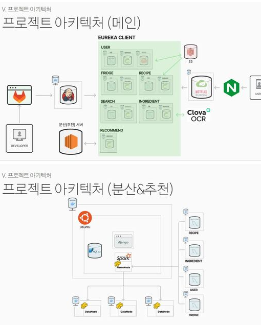

## ERD 다이어그램
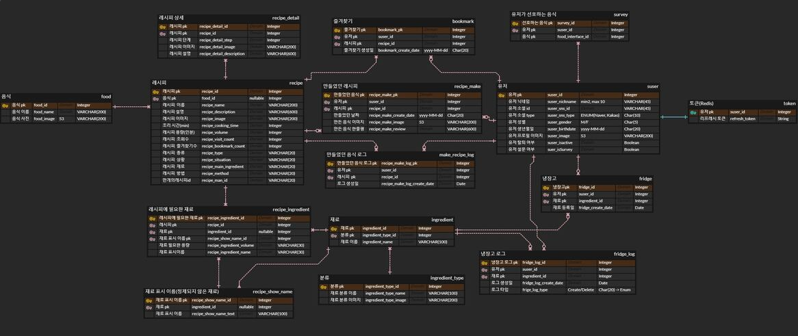

## 기술 스택
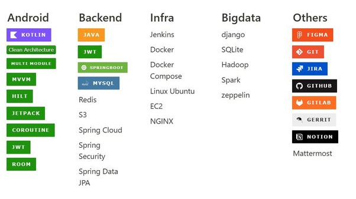


## 추천 시스템 

### 로그 기반 음식 추천
각 음식 마다 “ 요리방식, 메인재료, 부재료1, 부재료2, 부재료3 … “의 형태에서 같은 것이 얼마나 있는지를 기준으로 유사도를 계산한다. 

그런데 이렇게 되면 메인재료와 요리방식이 겹치는 음식과 부재료 2개(예를 들면 소금, 후추)가 같은 음식의 유사도를 같게 된다. 그래서 각 단어에 가중치가 있어야 된다고 생각했다. 

이를 위해서 모든 단어를 TF-IDF 변환해주었다. TF-IDF는 단어들마다 중요한 정도에 따라서 가중치를 부여하는 방법이다. 

모든 문서에서 등장하는 단어는, 중요도가 낮으며 특정 문서에서만 자주 등장하는 단어는 중요도가 높다.
이를 이용해서 요리방식, 메인재료, 부재료들 각각에 가중치를 주어 추천 할 수 있게 되었다.

### 유저 설문 기반 음식 추천 (유저 기반 협업 필터링)
협업 필터링은 제품에 대한 유저의 평가나 행동에 의존하여 추천하게 된다. 

새로운 유저의 경우 제품을 이용한 기록, 평점, 좋아요 등 행동에 대한 기록이 전혀 없기 때문에 협업 필터링 추천시스템은 cold start 문제에 매우 민감하게 반응한다. 

이를 해결하기 위해 회원가입시 유저에게 취향 설문조사를 받았다. 그리고 처음 서비스가 배포되었을 때 유저 데이터가 충분히 쌓이지 않아 비슷한 유저를 찾을 수 없는 문제가 있다. 

이를 해결하기 위해 음식 커뮤니티(만개의 레시피)의 유저와 그 유저의 음식 후기 데이터를 크롤링하여 이 문제를 해결하여 유저기반 협업 필터링의 추천을 구현하였다.

### 냉장고 재료 기반 음식 추천
기본은 첫번째의 로그 기반 추천과 매우 비슷하다. 각 음식은 “ 재료1, 재료2, 재료3 … “ 형태로 유저 냉장고 재료도 “재료1, 재료2, 재료3 ….” 형태로 만들어주고 냉장고의 재료와 음식의 재료 간의 유사도가 가장 높은 음식을 추천해준다. 

이를 위해 모든 음식의 모든 재료에 대한 전처리를 할 필요가 있었다. “감자”, “감자 작은것”, “감자 (중)”, “중간 크기 감자”, “감자中”, “중간크기 감자”를 모두 감자로 통일해 주었다.

## 주요 기능

### 회원 가입
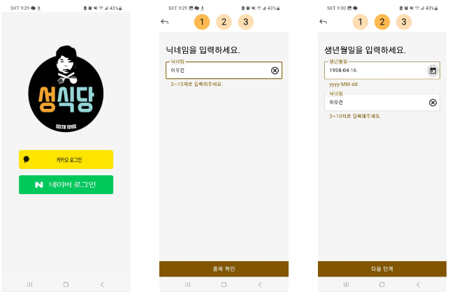
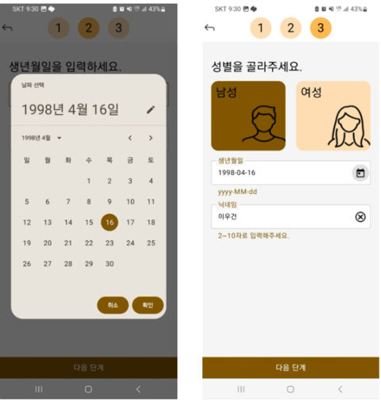

> 로그인, 회원가입 페이지 입니다. 카카오, 네이버 소셜 로그인으로 구현하였으며<br>Jwt Token 유무로 서버에서 Http 404 code를 받을 시 회원가입 페이지로 이동합니다.<br>회원가입에서 받는 정보는 닉네임, 생년월일, 성별 입니다.

### 설문하기 & 마이페이지
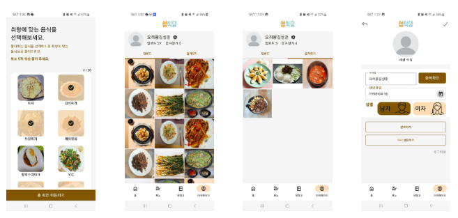

> 설문하기, 마이페이지 입니다. 설문조사 데이터는 음식 추천 로직에 사용됩니다.<br>마이페이지는 사용자가 음식을 업로드하거나 즐겨찾기한 목록을 볼 수 있습니다.

### 메인 화면
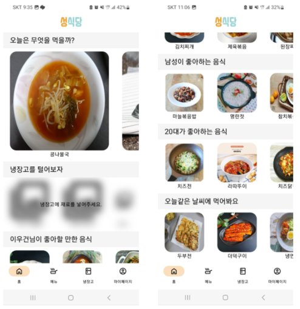

> 메인 화면 입니다. 사용자의 로그 기반, 설문 조사 기반, 냉장고 재료 기반으로 음식을 추천합니다.

### 검색 기능 / 메뉴 화면
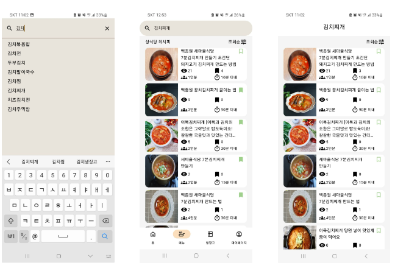
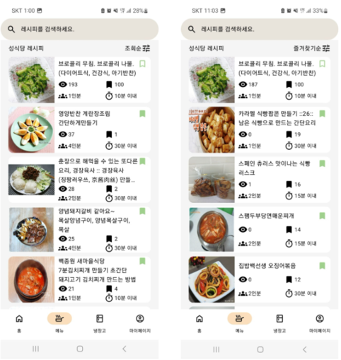

> 메뉴 페이지 및 검색 기능 입니다. 사용자는 음식을 검색 할 수 있고 즐겨찾기 등록을 할 수 있습니다.<br>기본 메뉴 페이지는 모든 음식을 보여주며 이를 위해 Paging을 사용하여 무한스크롤을 구현하였습니다.

### 메뉴 상세화면
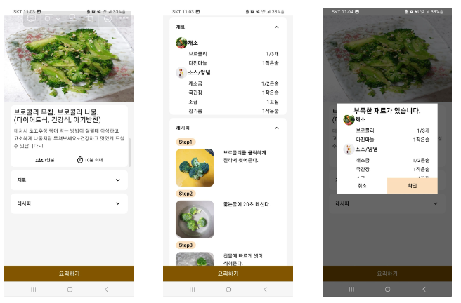

> 메뉴 상세화면 페이지 입니다. 메뉴 화면에서 음식을 클릭할 시 이동합니다.<br>사용자는 음식의 재료와 레시피를 볼 수 있고 요리를 시작 할 수 있습니다.

### 요리하기 
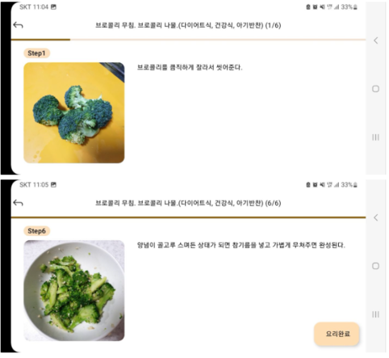

> 요리하기 페이지 입니다. 메뉴 상세화면에서 요리 시작하기 버튼을 클릭 시 이동할 수 있습니다.<br>사용자의 편의성을 위해 레시피를 TTS로 읽어줍니다.

### 요리 등록하기 / 재료 관리하기
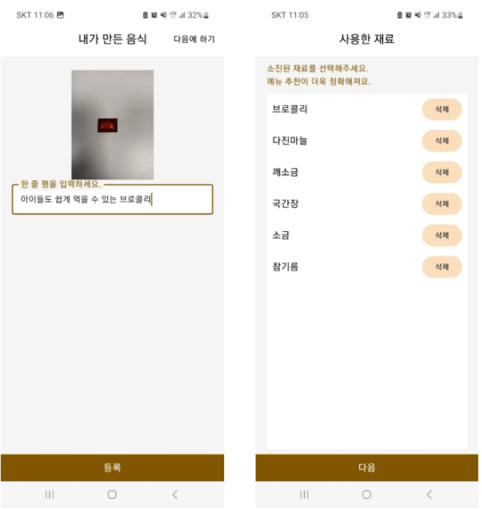

> 요리 등록하기 페이지 입니다. 요리하기 페이지가 끝나면 사용자는 본인의 요리를 등록하고 재료를 관리 할 수 있습니다.

### 냉장고 관리 페이지
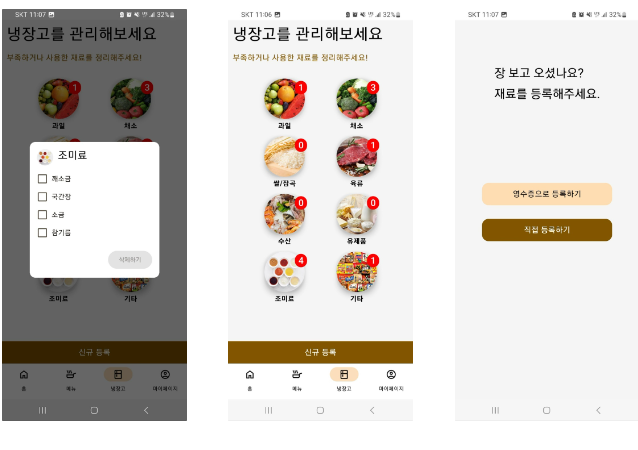
> 냉장고 관리 페이지 입니다. 사용자는 본인의 냉장고 재료를 확인 할 수 있고 요리에 필요한 재료를 등록 할 수 있습니다.

### 냉장고 등록 페이지 (OCR)
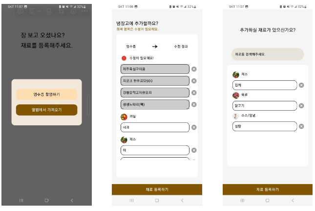
> 냉장고 등록 페이지 입니다. 사용자는 영수증을 촬영하면 OCR 기술로 영수증 내의 재료를 Json으로 변환합니다.<br>변환된 Json에서 재료를 추출하여 성식당에서 관리하는 재료 DB 테이블과 매핑하여 변환된 값을 나타냅니다.<br>사용자는 재료를 직접 등록 할 수도 있습니다.

## 팀원 소개
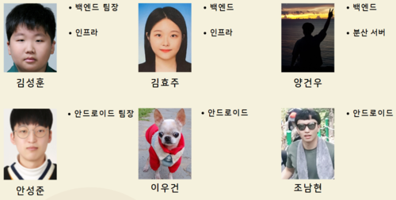
